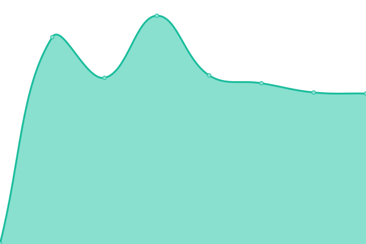

# [📈 Live Status](https://maique.github.io/maiqueTime): <!--live status--> **🟩 All systems operational**

This repository contains the open-source uptime monitor and status page for [maique madeira](https://maique.omg.lol), powered by [Upptime](https://github.com/upptime/upptime).

With [Upptime](https://upptime.js.org), you can get your own unlimited and free uptime monitor and status page, powered entirely by a GitHub repository. We use [Issues](https://github.com/maique/maiqueTime/issues) as incident reports, [Actions](https://github.com/maique/maiqueTime/actions) as uptime monitors, and [Pages](https://maique.github.io/maiqueTime) for the status page.

<!--start: status pages-->
<!-- This summary is generated by Upptime (https://github.com/upptime/upptime) -->
<!-- Do not edit this manually, your changes will be overwritten -->
<!-- prettier-ignore -->
| URL | Status | History | Response Time | Uptime |
| --- | ------ | ------- | ------------- | ------ |
|  [tiny notes](https://notes.maique.eu) | 🟩 Up | [tiny-notes.yml](https://github.com/maique/maiqueTime/commits/HEAD/history/tiny-notes.yml) | 

 867ms
     
 | 

<a href="https://maique.github.io/maiqueTime/history/tiny-notes">100.00%</a>
    

|  [Boo!](https://boo.maique.eu) | 🟩 Up | [boo.yml](https://github.com/maique/maiqueTime/commits/HEAD/history/boo.yml) | 

 650ms
     
 | 

<a href="https://maique.github.io/maiqueTime/history/boo">100.00%</a>
    

|  [micro maique](https://maique.eu) | 🟩 Up | [micro-maique.yml](https://github.com/maique/maiqueTime/commits/HEAD/history/micro-maique.yml) | 

 172ms
     
 | 

<a href="https://maique.github.io/maiqueTime/history/micro-maique">99.54%</a>
    

|  [dinkiwinkiminkiwinki](https://dinkiwinkiminkiwinki.com) | 🟩 Up | [dinkiwinkiminkiwinki.yml](https://github.com/maique/maiqueTime/commits/HEAD/history/dinkiwinkiminkiwinki.yml) | 

 716ms
     
 | 

<a href="https://maique.github.io/maiqueTime/history/dinkiwinkiminkiwinki">100.00%</a>
    

<!--end: status pages-->

[**Visit our status website →**](https://maique.github.io/maiqueTime)

## 📄 License

- Powered by: [Upptime](https://github.com/upptime/upptime)
- Code: [MIT](./LICENSE) © [Anand Chowdhary](https://anandchowdhary.com), supported by [Pabio](https://pabio.com)
- Data in the `./history` directory: [Open Database License](https://opendatacommons.org/licenses/odbl/1-0/)
